### Sistema de Votação

- Autor: Leonardo Paiva Vieira
- Site: <https://www.leovieira.dev>
- E-mail: <contact@leoviera.dev>

#### + Como utilizar o GitHub e o Git?
  - __Assita ao vídeo:__
      <https://www.youtube.com/watch?v=H1ppFeeeeg4>

#### + Como instalar os componentes de QR Code?
  - __1º passo:__
      Clone os arquivos deste repositório utilizando o git.

  - __2º passo:__
      Na pasta "arquivos" conterá as pastas cujo os nomes são "Barcode Scanner - Android" e "Componentes Nativos - iOS". Crie uma pasta no seu computador em 
	  Documentos com o nome "Componentes Delphi" e copie as duas pastas citadas acima para dentro dela.

      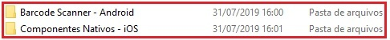

  - __3º passo:__
      Com o RAD Studio aberto vá em Tools > Options... > Delphi Options > Library, agora em Library path clique nos três pontos (...), abrirá um janela 
	  chamada "Directories", nela clique no ícone da pasta e navegue até a pasta o caminho "C:\seu caminho\Componentes Delphi\Barcode Scanner - Android\" 
	  selecione-o, após isso clique em Add. Repita o mesmo procedimento, portanto agora, para a pasta "Componentes Nativos - iOS". Clique em OK nas duas 
	  janelas abertas.

      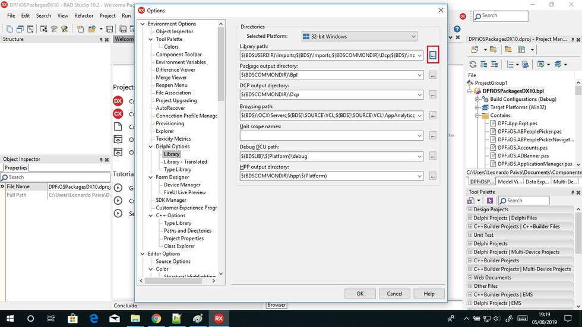

      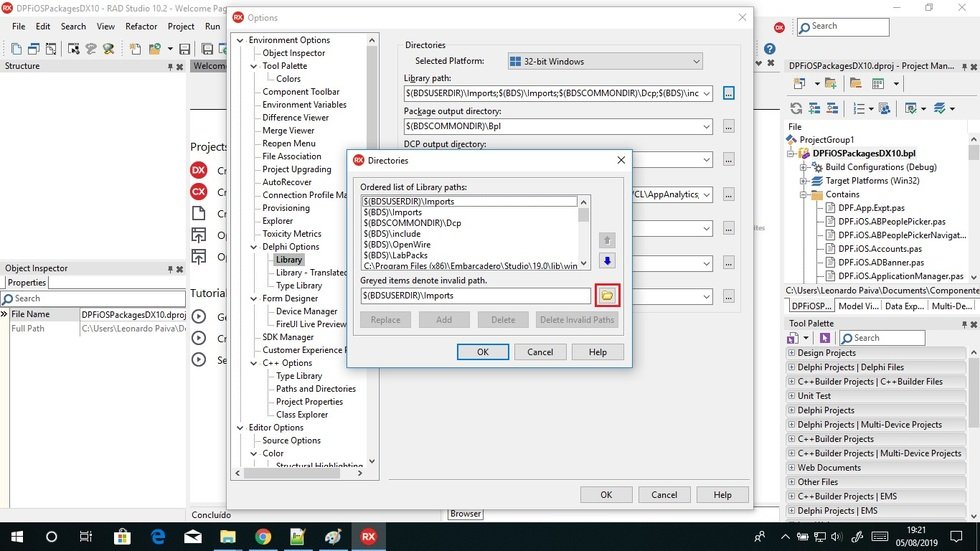

      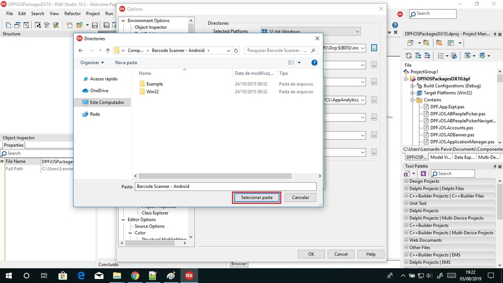

      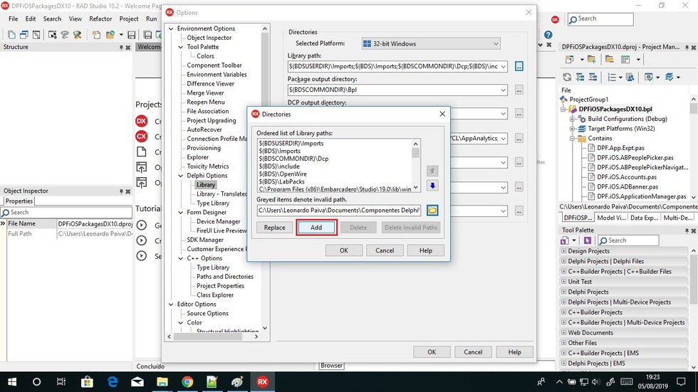

  - __4º passo:__
      Abra a pasta "Barcode Scanner - Android" e abra o arquivo "BarcodeScanner.dproj" com o RAD Studio.

      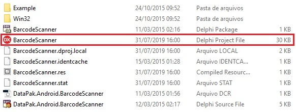

  - __5º passo:__
      Com o projeto aberto vá até Project Manager e clique com o botão direito do mouse sobre "BarcodeScanner.bpl" e clique em Build. Irá aparecer uma janela 
	  de confirmação, confirme-a.

      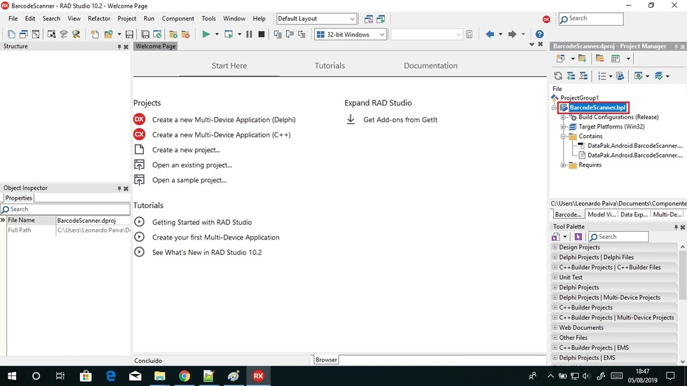

      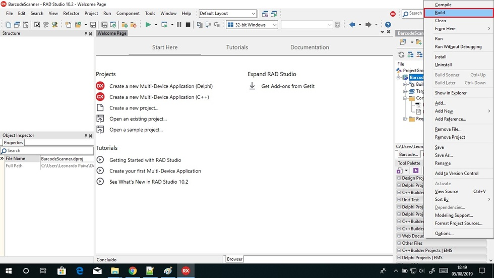

  - __6º passo:__
      Da mesma maneira clique agora em Install. Irá aparecer uma janela de confirmação, confirme-a.

      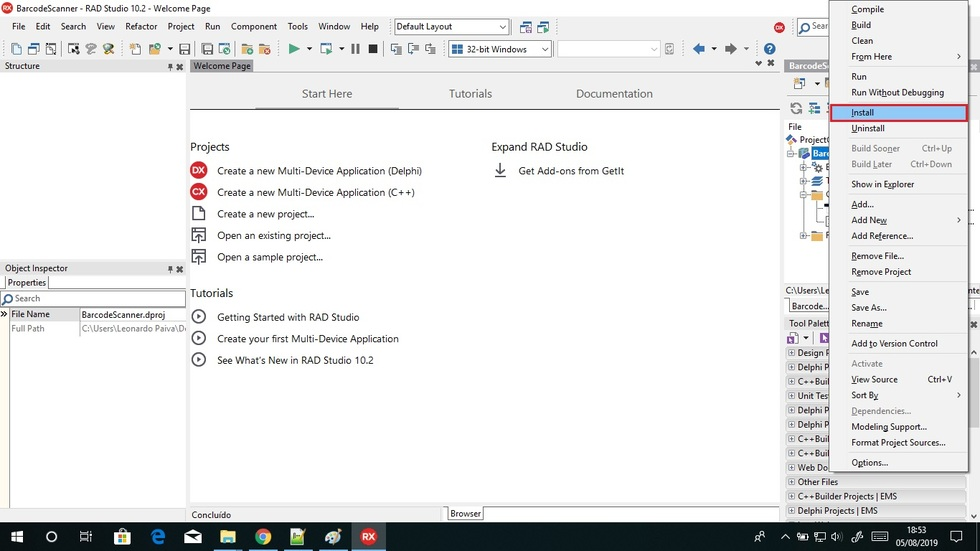

  - __7º passo:__
      Salve o projeto e feche ele. Agora na pasta "Componentes Nativos - iOS", abra o arquivo "DPFiOSPackagesDX10.dproj" com o RAD Studio.

      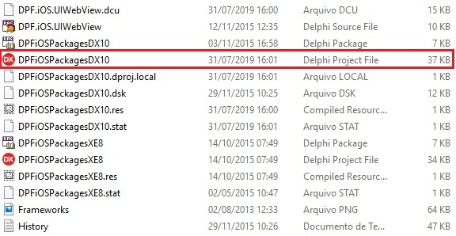 

  - __8º passo:__
      Com o projeto aberto vá até Project Manager e clique com o botão direito do mouse sobre "DPFiOSPackagesDX10.bpl" e clique em Build. Irá aparecer uma 
	  janela de confirmação, confirme-a.

      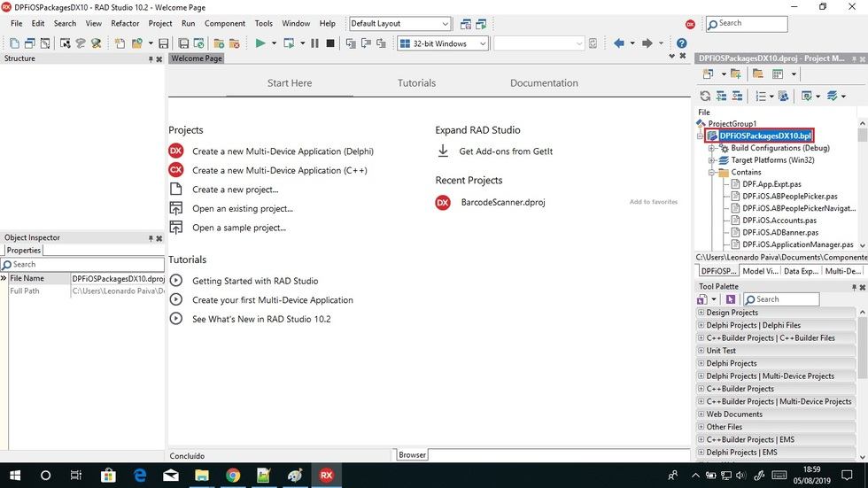 

      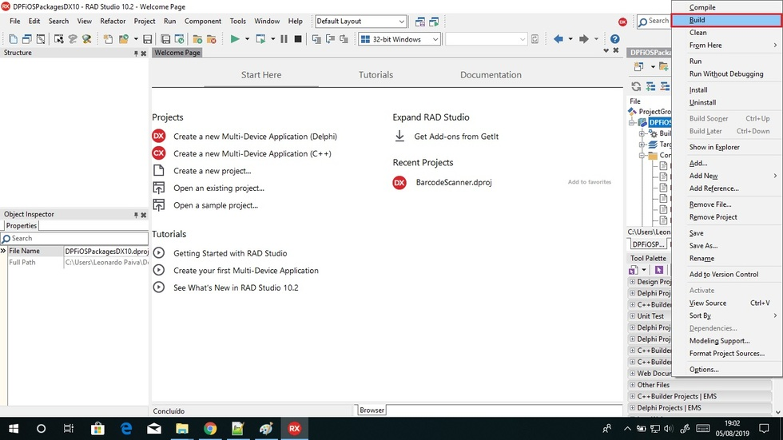 

  - __9º passo:__
      Da mesma maneira clique agora em Install. Irá aparecer uma janela de confirmação, confirme-a.

      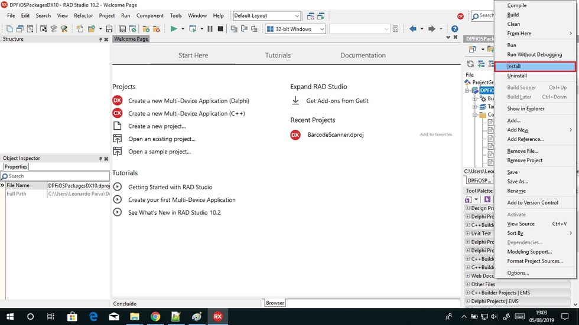 

#### + Como implementar o leitor de QR Code?
  - __Assita ao vídeo:__
      <https://www.youtube.com/watch?v=PyV0XN34NxA>

  - __Exemplo:__
      "C:\seu caminho\sistema-de-votacao\arquivos\exemplos\CodeBar\PrjCodeBarras.dproj".

#### + Duvidas em API (REST)?
  - __O que é:__
      API é um conjunto de rotinas e padrões de programação para acesso a um aplicativo de software ou plataforma baseado na Web. A sigla API refere-se ao 
	  termo em inglês "Application Programming Interface" que significa em tradução para o português "Interface de Programação de Aplicativos". 
	  Representational State Transfer (REST), em português Transferência Representacional de Estado, é um estilo de arquitetura de software que define um 
	  conjunto de restrições a serem usados para a criação de web services.

  - __Assita ao vídeo:__
      <https://www.youtube.com/watch?v=7s5_TmBqZR8>

  - __Exemplo Online:__
      <https://viacep.com.br/ws/76200000/json/>

  - __Explicação:__
      Bom... esta é um API simples, nela podemos notar que passamos como parâmetro o CEP que você deseja que o sistema busque informações sobre ele e também o 
	  formato do arquivo para o request neste exemplo passei o "json" podendo ser também o "xml". Portanto, o "json" é um formato muito mais leve para ser 
	  trafegado pela a internet. Concluímos então que o software faz um request (requisição) ao servidor através do protocolo HTTP passando ou não parâmetros, 
	  e então o servidor retorna um response (resposta) no formato que foi programado (txt/json/xml) contendo as informações à serem consumidas por uma aplicação.

  - __Exemplo 1:__
      "C:\seu caminho\sistema-de-votacao\arquivos\exemplos\api\exemplo1".

  - __Exemplo 2:__
      "C:\seu caminho\sistema-de-votacao\arquivos\exemplos\api\exemplo2".

  - __Explicação:__
      Este exemplo 2 é uma API feita em PHP que pega a data e a hora de um site e retorna em forma de json, é passado como parâmetro o 'nome' (string) e é 
	  exibido também no json.

#### + Como utilizar a API do projeto?
  - __1º passo:__
      Com o XAMMP instalado no seu computador, copie a pasta "api" para dentro de "htdocs" do seu computador.

  - __2º passo:__
      Abra o phpMyAdmin no seu navegador e importe o banco de dados presente na pasta "db".

#### + Relação da API do projeto:
  - __Importante:__
      A chave de autenticação da API é: "dpc0p1yim82b5s0tfk3s".
	  Espaços na URL usa-se: "%20".

  - __Horas de Brasília:__
      A URL base é : "http://localhost/api/horas-de-brasilia.php?key={chave}".
      Exemplo: "http://localhost/api/horas-de-brasilia.php?key=dpc0p1yim82b5s0tfk3s".
